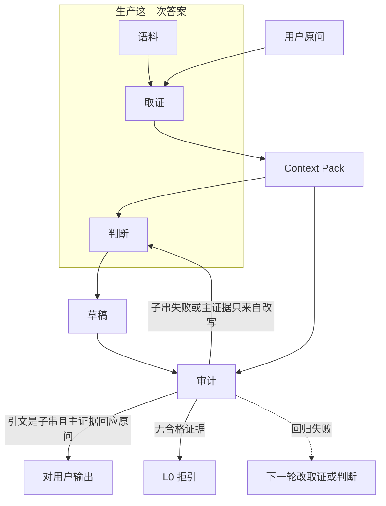
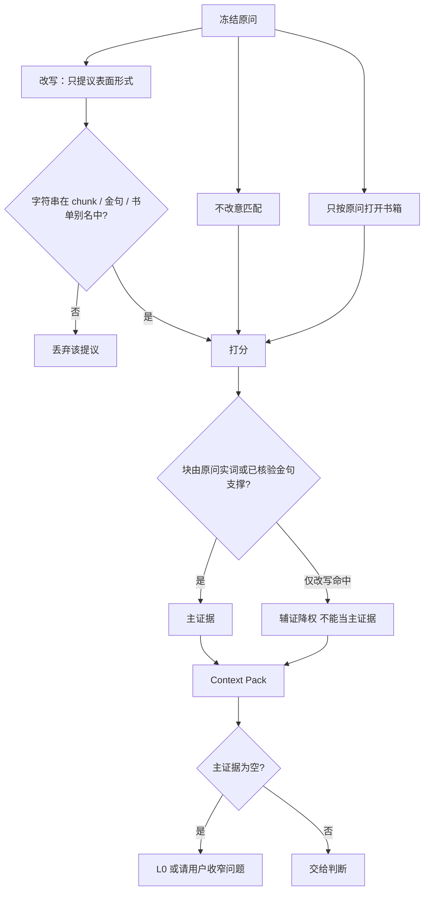
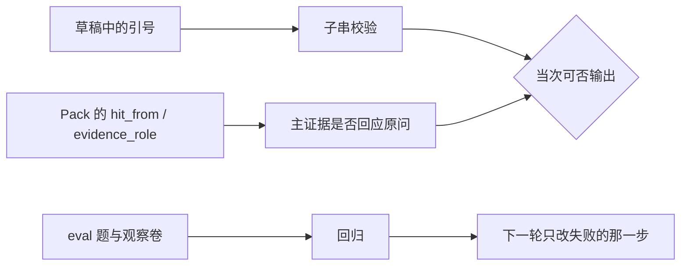

# 14 · 解答方案

本文记录已讨论定下的解答架构。阅读对象是「一次咨询如何从原问走到可核对的回答」。

## 0. 写法原则

方案的结构以流程图为准。此写法不限于本文，后续任何项目的方案都先画流程图，再写合同。改模块边界或数据走向时，先改对应的图，再改表和段落。图里没有的步骤，不写成已经定下的流程。

- 粗粒度一张图：谁生产答案，谁只做门禁。
- 每个需要展开的模块一张图：输入、分支、丢弃、交给下一步的产物。
- 图上的框必须能指回后文的一个模块或一条合同，避免只有装饰箭头。

路线图与分发包见 [08](08-phases-roadmap.md)、[13](13-meta-skill.md)。检索与改写的现行脚本行为见 [04](04-retrieval.md)、[12](12-script-language-retrieval.md)。本文是目标合同；与现有代码不一致处在 §6 标明。

## 1. 业务目标

面对一个人生或职业两难，系统只根据已经入库的原文给出判断，并且每条典据都能在底本里逐字核对。他人拿到的是建库协议和脚本，不是某一个人的全书。

| 需求 | 验收 |
|------|------|
| 有库才引典 | 无 ready 书，或取证不足，走 L0，不写「书中曰」 |
| 引文可核对 | 依据栏是某个 chunk 的连续子串；繁简折叠和翻译都不算通过 |
| 选题跟原问有关 | 被引用的块能回应原问，而不是只回应改写后的范畴 |
| 分析与原文分栏 | 「原文所述」和「延伸推论」分开；方略过假可执行审判 |
| 语言可混存 | 简体提问；底本可以是简体、繁体或英文；回答用中文 |
| 可换书单重建 | 改 BOOKLIST 能建成另一套库；skill 包不含正文 |

## 2. 粗粒度：四部分

按职责切成四部分。语料、取证、判断直接生产这一次答案。审计不生产方略：当次它决定能否把引文交给用户；跨次它用失败案例驱动取证和判断的修改。

| 部分 | 守什么 | 不做什么 |
|------|--------|----------|
| 语料 | 有哪些书、底本原文、可引用的块、已核验金句 | 不解释人生问题 |
| 取证 | 按原问选出少量相关原文，并标明为何入选 | 不写方略，不把改写句当成原问 |
| 判断 | 只在 Pack 上立一个主矛盾、分栏、给七日动作 | 不使用 Pack 外的句子作原文 |
| 审计 | 子串为真；主证据是否答非所问；换书单能否重建 | 不代替取证去「找一句更像的」 |

发布约束附在语料上，不是第五种运行时能力：`pack_skill.py` 只复制协议和脚本；`corpus/` 正文留在本机。

按脚本清点时会看到六段工序（书单、切块、检索、起草、校验、评测/分发）。那是实现清单。讨论方案时用上面四部分。

## 3. 细粒度

### 3.1 语料

一块是检索和引用的单位。字段：`id`、`book_id`、`locus`、`text`、前后块、字数、`retrieval_language`。`text` 保持底本字形，不另存简体译文当真相源。

路径顺序：`--corpus-root`、`SSQS_CORPUS_ROOT`、工作区 `corpus`、skill 内空骨架。空骨架里没有全书，COUNSEL 不得假引。

### 3.2 取证

解答质量主要在这里决定。判断只能使用交上来的块。

取证分成四步。改写是第二步里的提议，不是把原问翻译成一套道理。

**冻结原问。** 要回答的问题只看用户原句。改写不得新开书箱，不得替换 Pack 里的 `query`。

**不改意匹配。** 繁简折叠、原句中的专名和实词、已经核验的中英对照表。这一步不引入原问里没有的概念。

**改写只提议表面形式。** 允许简体专名的繁体、书中已有的英文对译、金句库里已经挂在标签上的短句。不允许把现代处境换成模型常用范畴，也不允许写出库中未必存在的整句。模型看不见全书，因此不存在一种改写能够单独保证检索优质。

**库验收提议。** 提议必须是某个 chunk、金句或书单别名的子串，否则丢掉。留下来的块还要能指回原问里的实词，或指回一条已核验金句。只因改写而命中的块降权，不能当主证据。主证据为空时，结果是 L0 或请用户收窄问题，而不是再改写一轮。

Pack 至少包含：

| 字段 | 含义 |
|------|------|
| `query` | 用户原问 |
| `rewritten_queries` | 被采纳的表面形式提议；不是原文，也不是要回答的问题 |
| `chunks[]` | 底本原文、locus、语言 |
| `hit_from` | `original` 或 `rewrite` |
| `evidence_role` | `primary` 或 `auxiliary` |

两件可分开验收的事：

- 原意有没有被换掉：主证据是否仍由原问实词或已核验金句支撑。
- 改写有没有帮上忙：被采纳的字符串是否真在库里；拿掉它之后主证据是否还在。

### 3.3 判断

没有独立程序，是 skill 的 Mode COUNSEL。输入只有 Pack 和原问。

输出栏顺序固定：事实、一个主矛盾、原文依据、据文分析、延伸推论、上策 / 中策 / 不可做、七日内最小动作、复盘信号。

- 依据栏只复制 `evidence_role = primary` 的 `chunks[].text`。
- 辅证可以出现在分析里，但要标明不是主证据。
- 延伸推论必须标明「非原文」。
- 一次一个主源，至多一个辅源；展示的原文依据宜少。
- 《君主论》一类权术分析必须带合法性 / 伤害红线。
- 方略必须能在用户已有的时间、权力、关系里做完。

### 3.4 审计

当次门禁：

- L2：引文是 Pack 中某块的连续子串。失败则删引或整段降为 L0。
- 主证据的 `hit_from` 不是单纯的 `rewrite`。若是，退回取证，不把该块写成「书中对这个问题的回答」。

跨次驱动：

- `eval/cases.jsonl`：某问是否命中期望的书、假引文是否被拒。
- 观察卷：Pass-1 高分块是否答非所问。失败项回写到取证的开书箱、扩词或打分，而不是再写一篇更长的方略。
- `run_coldstart.py`：空库 0 命中；临时书单能重建至少两本并校验通过。

## 4. 与现有实现的对应

| 方案模块 | 现有落点 |
|----------|----------|
| 语料 · 书单与骨架 | `corpus/BOOKLIST.yaml`、`scripts/bootstrap_corpus.py`、`scripts/paths.py` |
| 语料 · 抓取 | `scripts/fetch_from_booklist.py`、`scripts/adapters/` |
| 语料 · 切块与金句 | `scripts/ingest.py`、`corpus/chunks/`、`corpus/quotes/curated.jsonl` |
| 取证 | `scripts/retrieve.py` |
| 判断 | `~/.cursor/skills/shi-shi-qiu-shi/SKILL.md` Mode COUNSEL |
| 审计 · 当次 | `scripts/verify_quotes.py` |
| 审计 · 跨次 | `scripts/run_eval.py`、`scripts/run_coldstart.py`、`eval/counsel-logs/` |
| 发布 | `scripts/pack_skill.py` |

## 5. 数据不变量

- chunk 的 `text` 是底本原文。
- 匹配可以用繁简折叠和英文对译；引用永远贴回未折叠、未翻译的 `text`。
- `rewritten_queries` 永不进入「原文依据」。
- 无 primary 证据时，输出里没有典籍引号。

## 6. 现有取证与本方案的缝

`retrieve.py` 今天仍是一次打分，还没有 §3.2 的四步合同：

- `guess_boxes` 用正则开书箱，extra 查询也会参与开书箱；文档上的「只按原问」尚未落成代码。
- `expand_terms` 把原问 2-gram、中译英表和 `--extra-queries` 放进同一袋词。
- 打分按词出现次数累加，没有 `hit_from` / `evidence_role`。
- `verify_quotes.py` 只做子串，不检查主证据是否回应原问。

因此当前可以承诺「引文是真的」，还不能单靠脚本承诺「引的是在回答原问」。判断阶段若手工丢掉无关高分块，只对那一次咨询有效。
